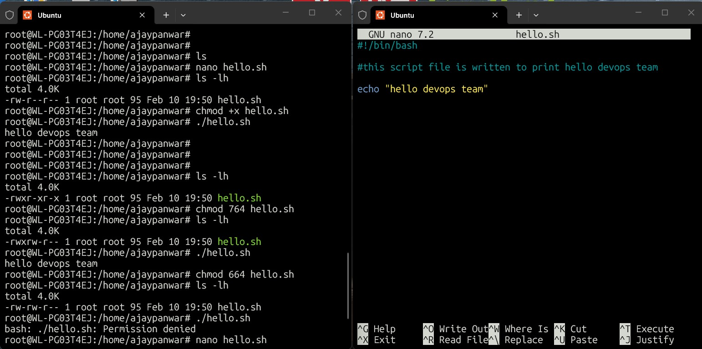
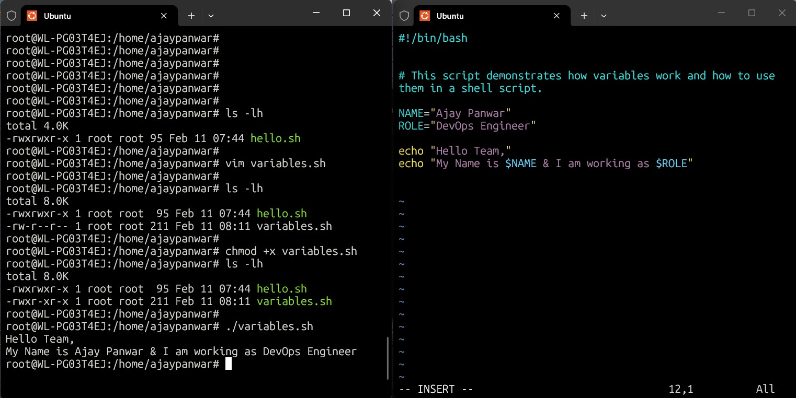
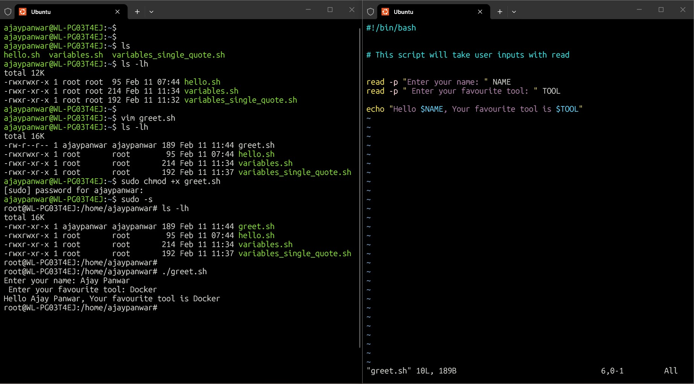
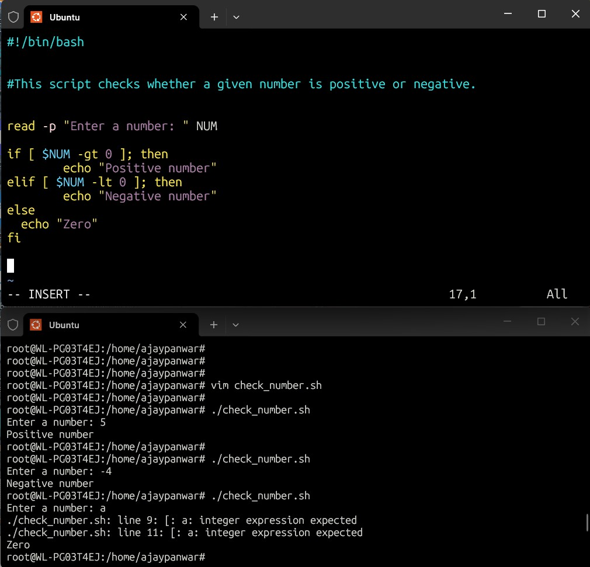
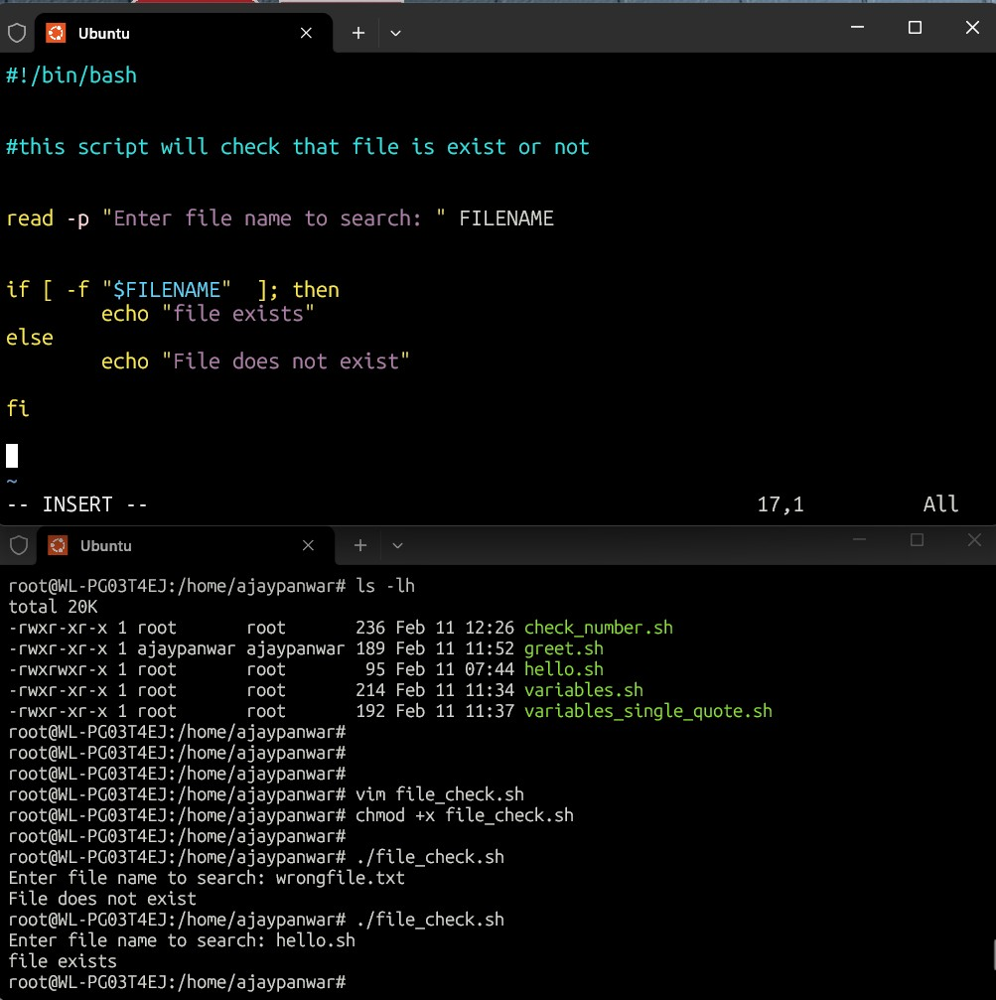
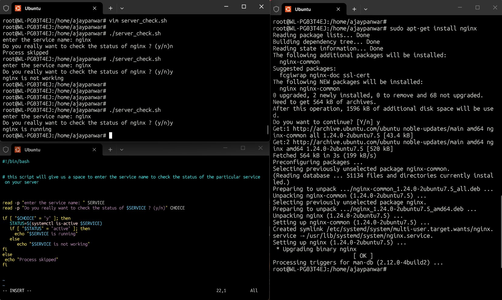

# Day 16 – Shell Scripting Basics

## Objective
To understand the basics of shell scripting including shebang, variables,
user input, and conditional logic.

---

## Scripts Created
- hello.sh
- variables.sh
- greet.sh
- check_number.sh
- file_check.sh
- server_check.sh

---

## Task 1: First Script
- Used shebang `#!/bin/bash`
- Learned why interpreter declaration matters

---

## Task 2: Variables
- Used variables to store name and role
- Observed difference between single and double quotes

---

## Task 3: User Input
- Used `read` to accept user input
- Printed dynamic messages

---

## Task 4: Conditional Logic
- Used if-elif-else for number check
- Used file existence check with `-f`

---

## Task 5: Service Status Script
- Give space to enter the service name
- Stored service name in variable
- Used `systemctl is-active`
- Implemented decision-based execution

---

## What I Learned
- Shell scripts automate repetitive tasks
- Shebang defines script execution behavior
- Conditionals make scripts intelligent
