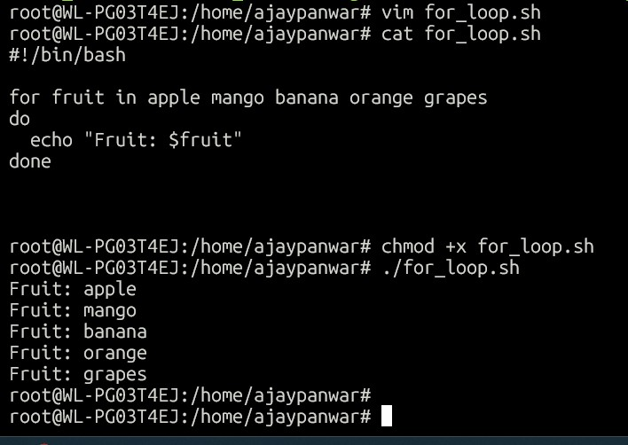
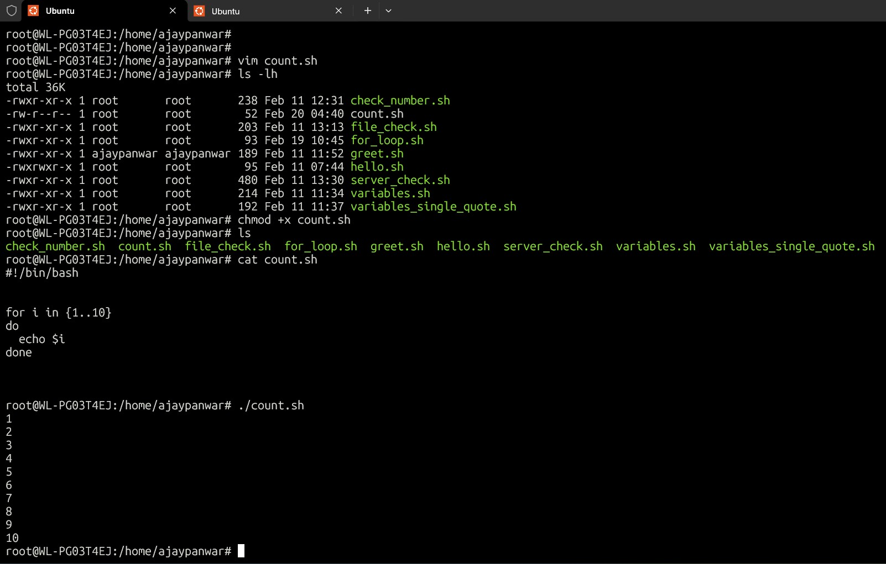
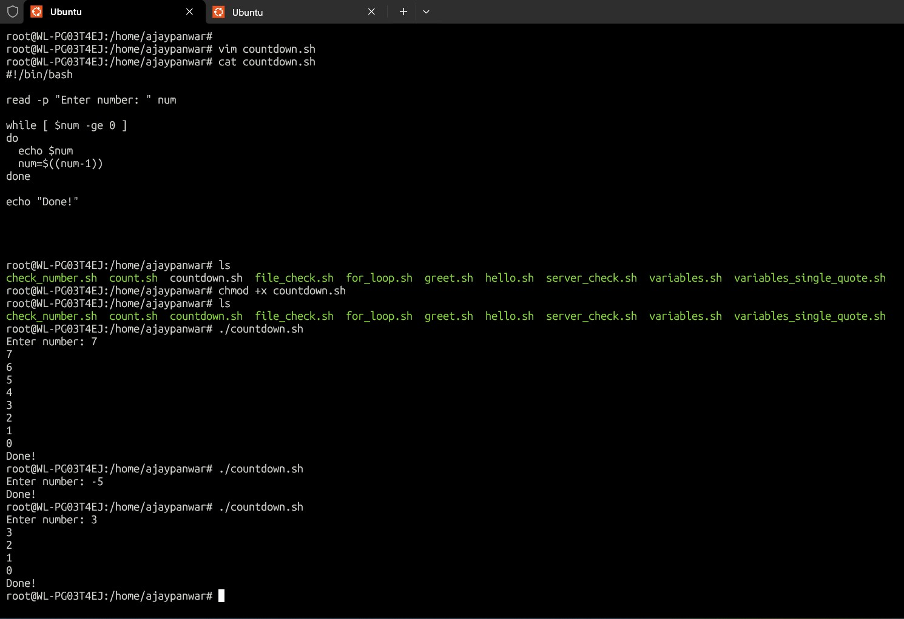
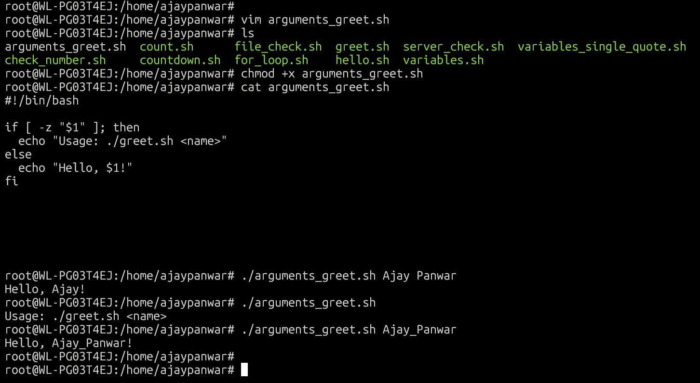
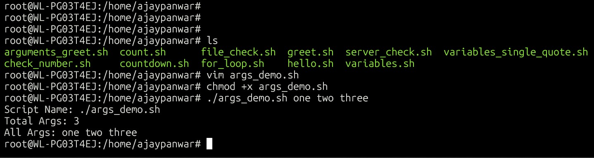
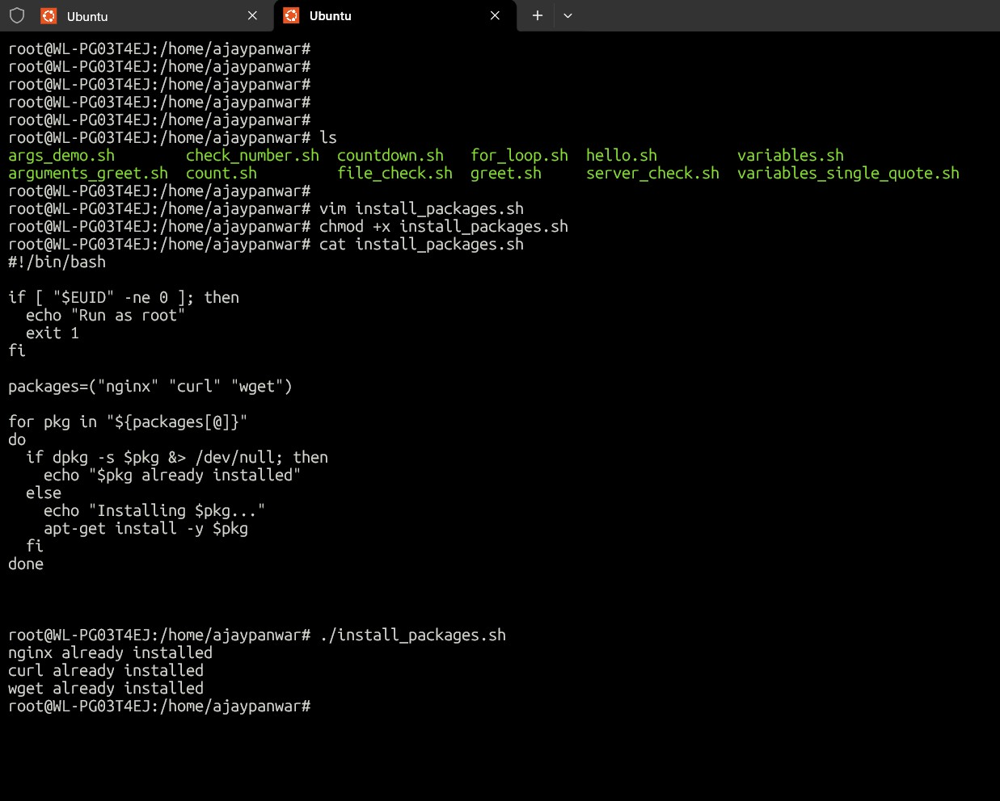
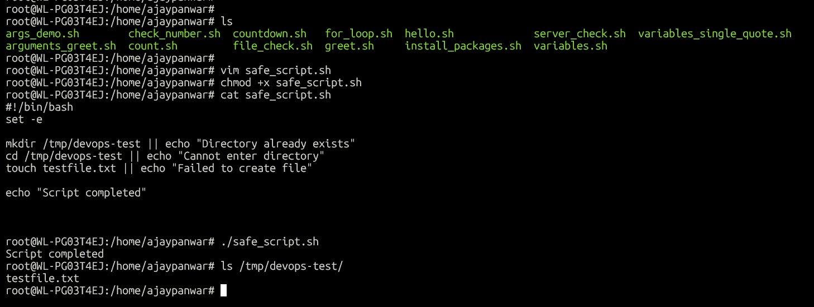

# Day 17 – Shell Scripting: Loops, Arguments & Error Handling

---

## Scripts Created
- for_loop.sh

- count.sh

- countdown.sh

- arguments_greet.sh

- args_demo.sh

- install_packages.sh

- safe_script.sh

--- 
## Key Learnings
- For and while loops help automate repetitive tasks
- Command-line arguments make scripts reusable
- Error handling using set -e improves script safety

---

## Observations
- Using root check prevents permission errors
- Scripts can automate package installation easily
- Error handling avoids partial execution failures

---