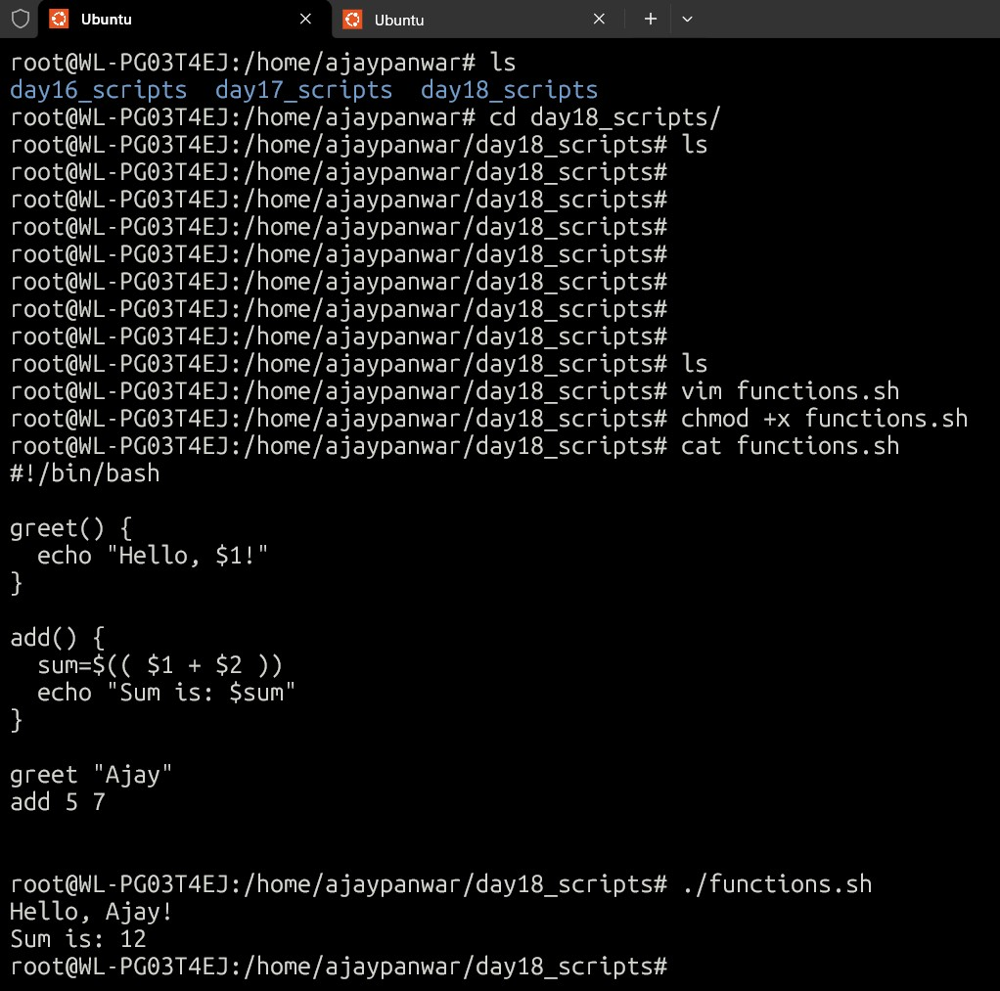
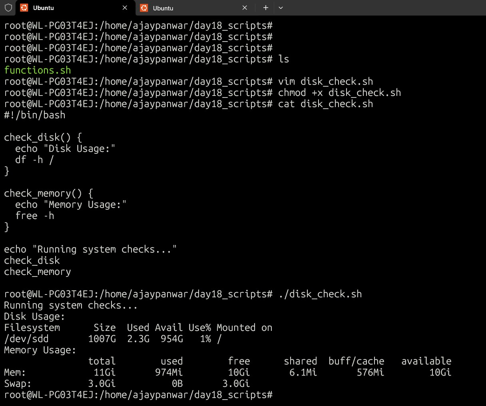
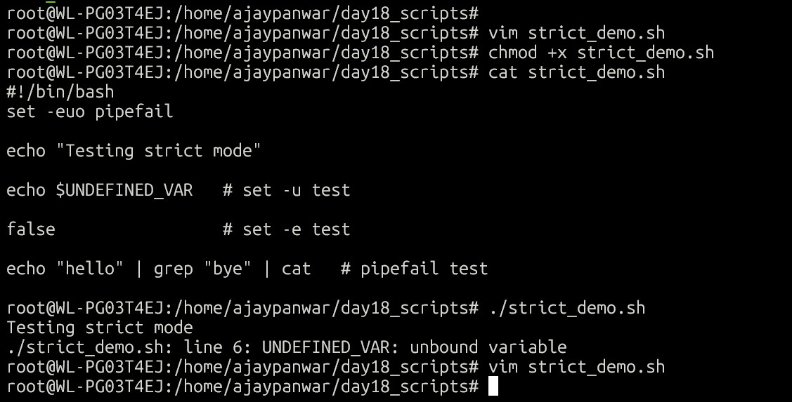
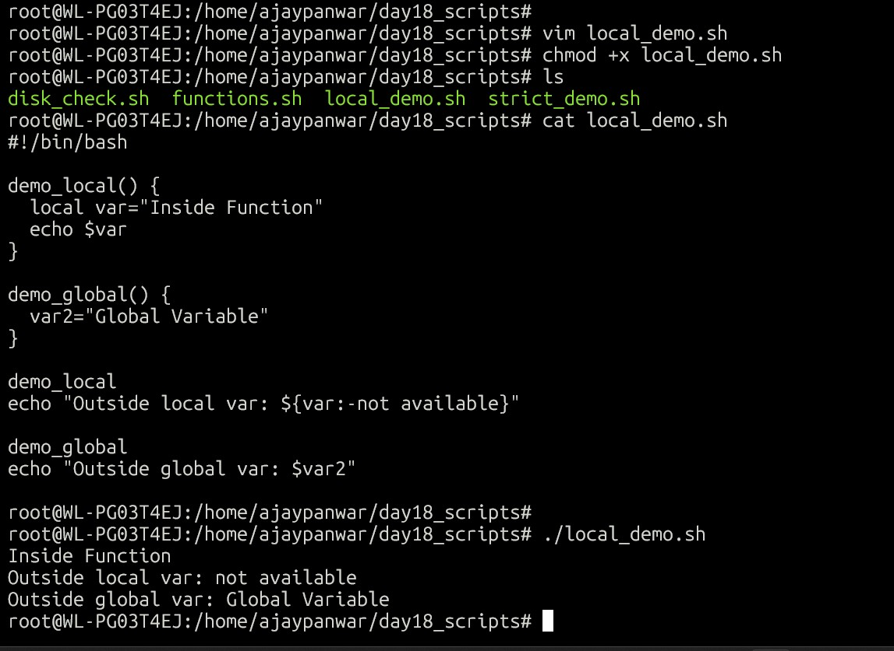
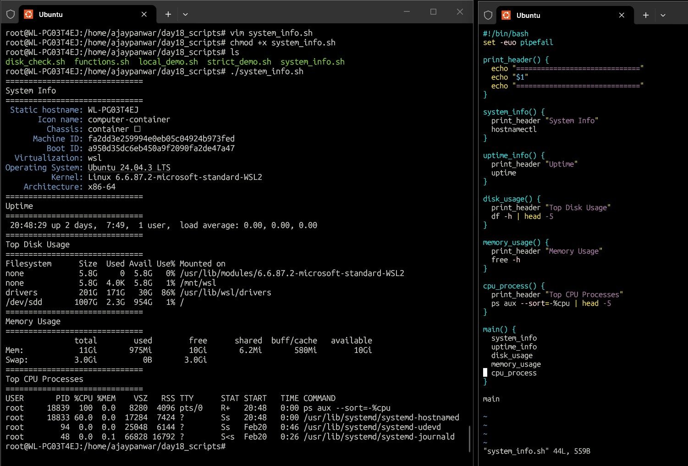

# Day 18 - Shell Scripting: Functions & Intermediate Concepts

---

## 📜 Scripts Created

- functions.sh
- disk_check.sh
- strict_demo.sh
- local_demo.sh
- system_info.sh

---

## ⚙️ Functions Script

### Functions help in reusable and modular scripting.

---

## 💽 Disk Check Script

### Used to monitor disk usage using df command.

Commands used:

- df -h
- free -h

---

## 🧪 Strict Mode Demo

### Strict mode improves script reliability.

- set -e → Exit if command fails  
- set -u → Exit if undefined variable used  
- set -o pipefail → Pipeline fails if any command fails  

---

## 🧩 Local Variables Demo

### Local variables avoid accidental overwrites inside functions.

---

## 🖥️ System Info Script

### This script displays system details like memory, processes etc.

Commands used:

- df -h
- free -h
- ps aux

---

## 📚 What I Learned

- Functions make scripts reusable and cleaner
- Strict mode prevents hidden script failures
- Local variables improve script safety
- Monitoring commands help in DevOps troubleshooting

---