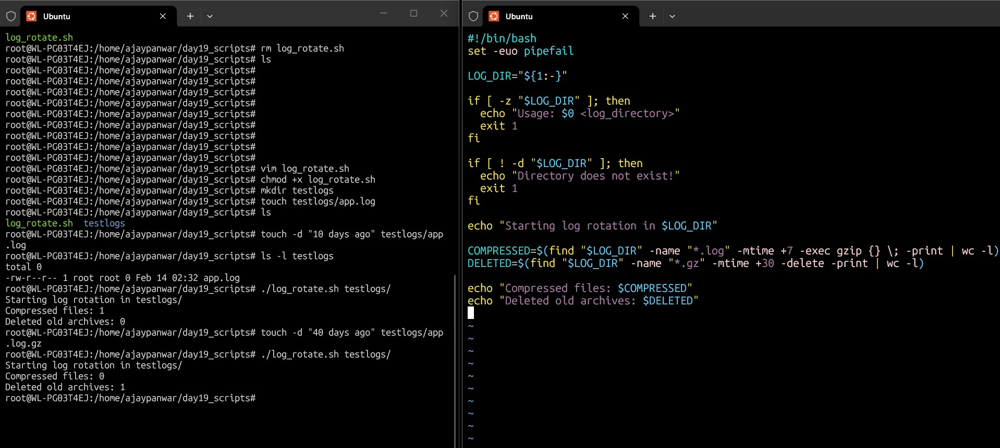
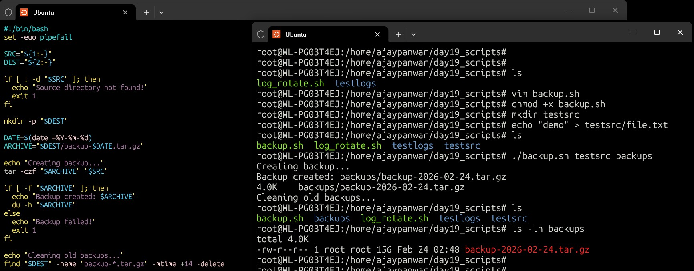
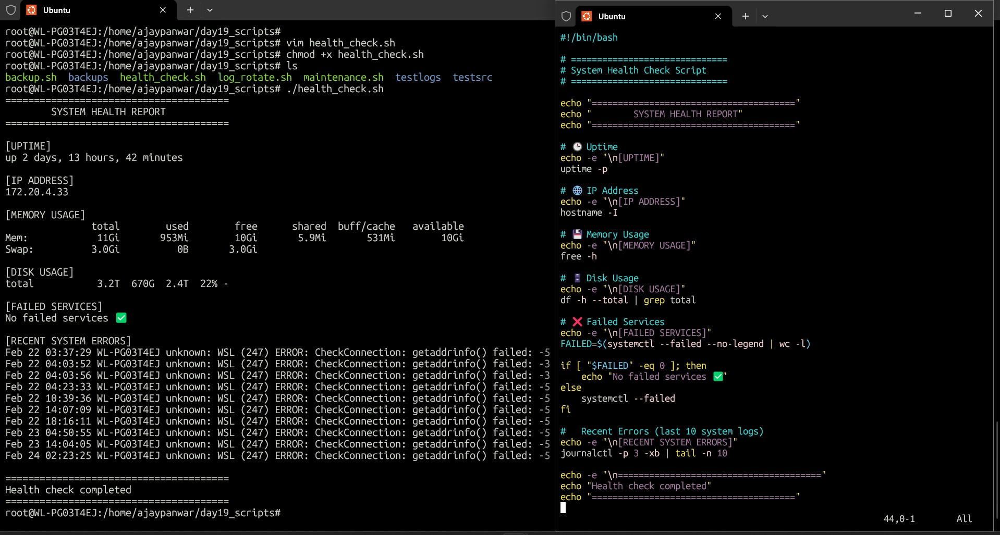
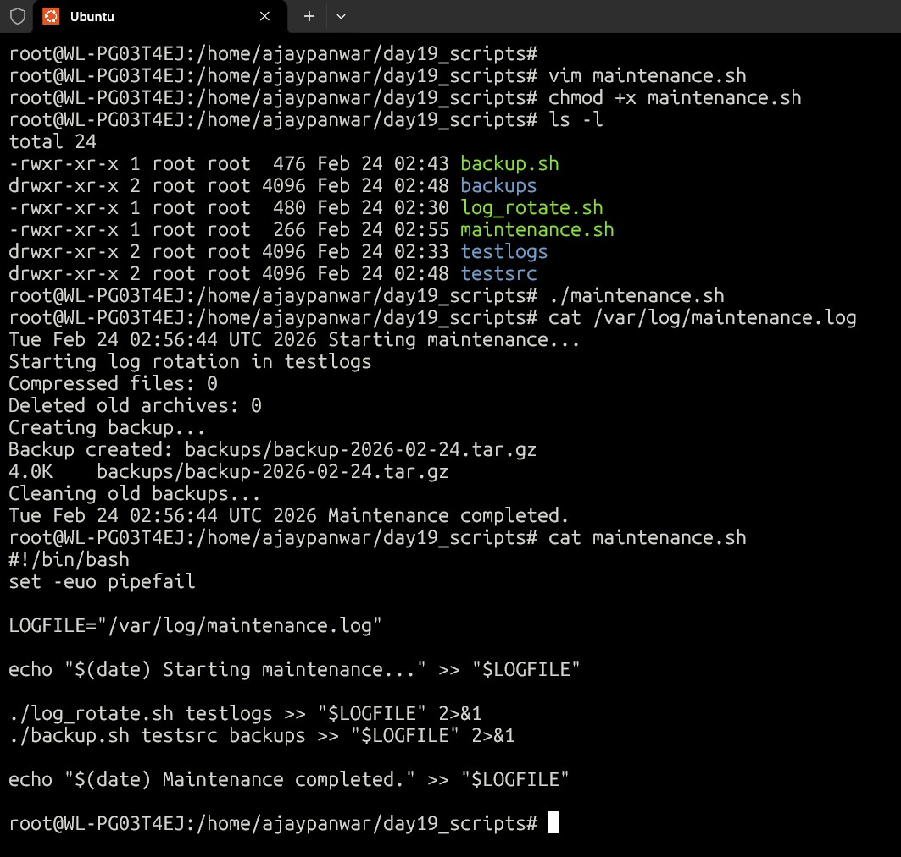
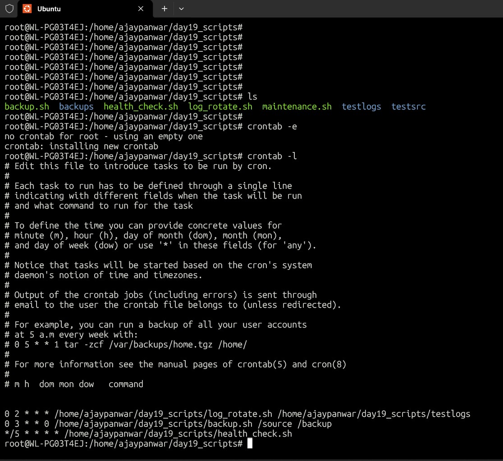

# Day 19 – Shell Scripting Project: Log Rotation, Backup, health checkup & Crontab

---

### 🚀 Scripts Created

- log_rotate.sh
- backup.sh
- health_check.sh
- maintenance.sh

### 🧩 Log Rotation Script – log_rotate.sh

- Compresses .log files older than 7 days
- Deletes .gz archives older than 30 days
- Validates directory existence before execution
- Uses safe bash options (set -euo pipefail)

---

### 💾 Backup Script – backup.sh

- Creates timestamped .tar.gz backups
- Validates source directory before running
- Automatically removes backups older than 14 days

---

### ❤️ System Health Check – health_check.sh

- This script provides a quick system monitoring overview:
- System uptime
- Server IP address
- Memory utilization and free memory
- Disk usage summary
- Failed systemd services
- Recent critical system errors (journalctl)

---

### 🛠️ Maintenance Script – maintenance.sh

- Acts as a wrapper script=
- Calls log rotation and backup together
- Designed for automated maintenance workflows
- Can log output to a maintenance log file

---

### ⏰ Cron Jobs Configured

0 2 * * * /home/ajaypanwar/day19_scripts/log_rotate.sh /home/ajaypanwar/day19_scripts/testlogs
0 3 * * 0 /home/ajaypanwar/day19_scripts/backup.sh /source /backup
*/5 * * * * /home/ajaypanwar/day19_scripts/health_check.sh

---

### 📚 What I Learned

- Input validation is critical in automation scripts
- Using full absolute paths is required in cron jobs
- System health monitoring can be automated with shell scripts
- Logging and scheduled jobs are core DevOps practicesWriting modular scripts improves maintainability

---