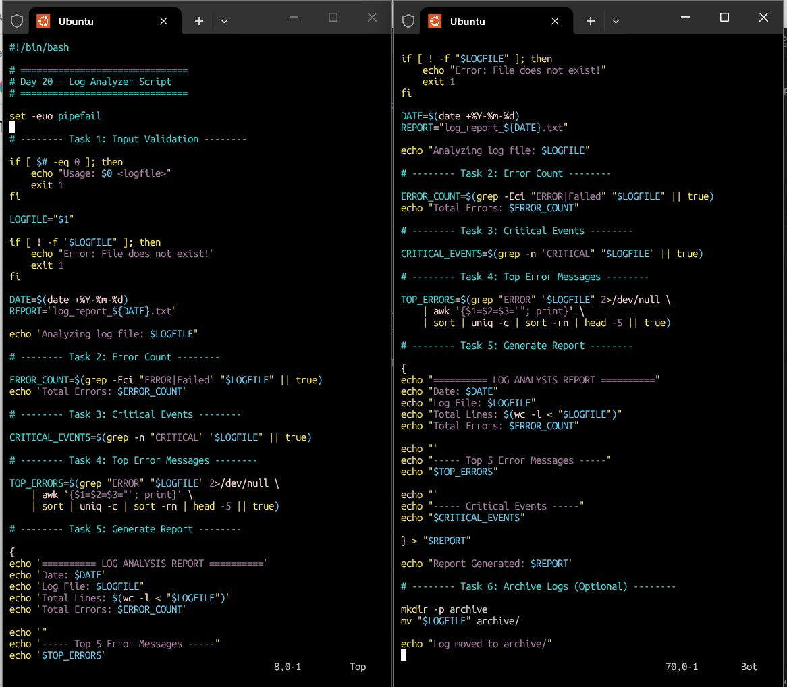
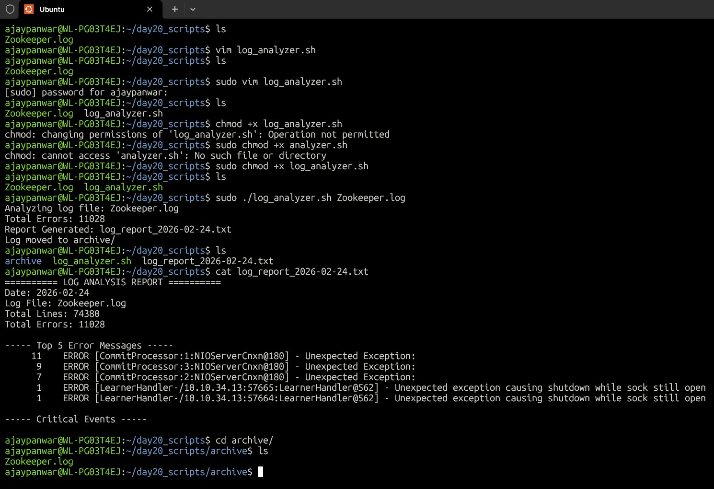
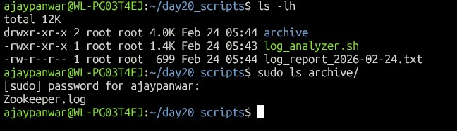

# Day 20 – Log Analyzer & Report Generator

---

## Script Created
log_analyzer.sh

---

## What Script Does
- Validates input log file
- Counts ERROR and Failed entries
- Detects CRITICAL events with line numbers
- Finds Top 5 error messages
- Generates timestamped report
- Archives processed logs

---

## Commands Used
- grep
- awk
- sort
- uniq
- wc
- mv
- date

---

### Files Generated

- log_report_2026-02-24.txt
- /archive/Zookeeper.log

### What I Learned

- Real-world log parsing using Bash
- Combining grep + awk + sort pipelines
- Building automation-ready scripts

---