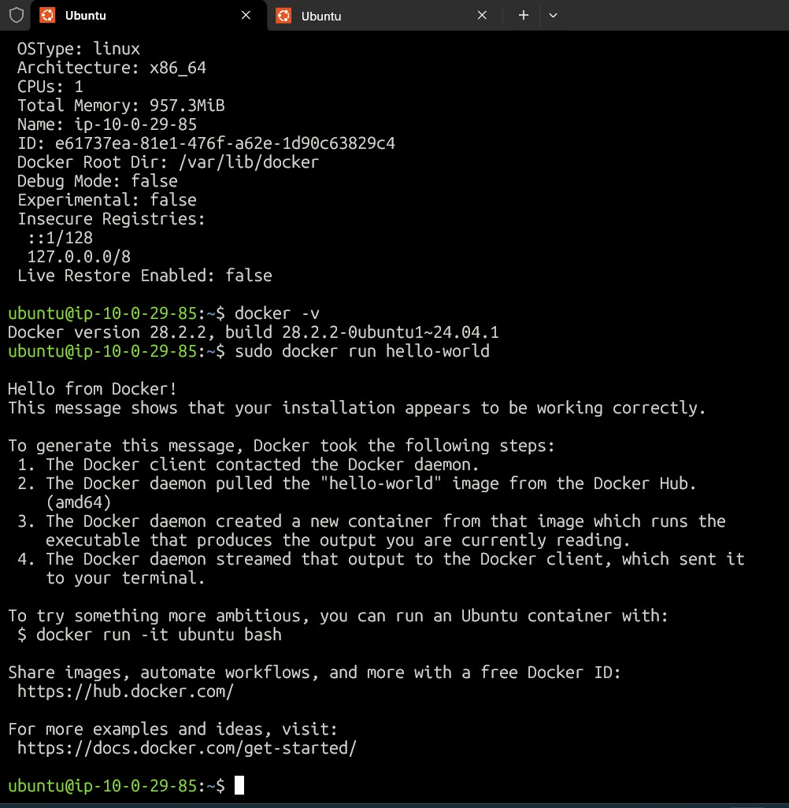
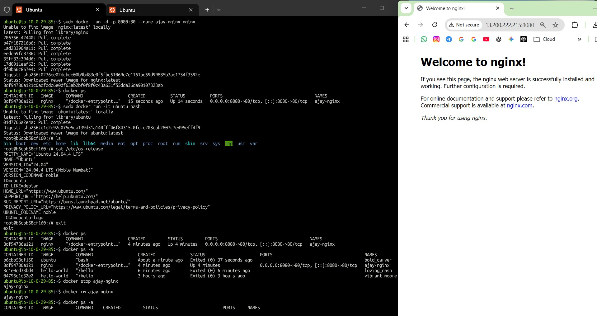
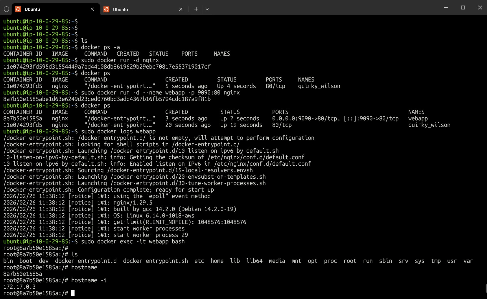

# Day 29 – Introduction to Docker

## Task 1: What is Docker?

### What is a Container?
A container is a lightweight environment that packages an application with its dependencies so it runs the same everywhere.

### Containers vs Virtual Machines
- Containers share host OS kernel → lightweight & fast.
- VMs run full OS → heavier & slower.
- Containers start in seconds, VMs take minutes.

### Docker Architecture
Docker has:
- Docker Client → where commands run
- Docker Daemon → manages containers
- Images → templates
- Containers → running instances
- Registry → Docker Hub

#### Flow:
- Client → Daemon → Pull Image → Run Container

---

## Task 2: Install Docker

### Install Commands
```bash
sudo apt update
sudo apt install docker.io -y
Verify Installation
docker --version
docker info
Hello World Test
sudo docker run hello-world
```


---

## Task 3: Run Real Containers
```bash
Run Nginx Container
sudo docker run -d -p 8080:80 --name my-nginx nginx
```
- Access via browser:
- http://13.200.222.215:8080

- Ubuntu Interactive Container
```bash
sudo docker run -it ubuntu bash
```
- Commands executed:
```bash
ls
cat /etc/os-release
exit
List Containers
sudo docker ps
sudo docker ps -a
```
- Stop & Remove
```bash
sudo docker stop my-nginx
sudo docker rm my-nginx
```


---

## Task 4: Explore

- Detached Mode
```bash
sudo docker run -d nginx
```
- Custom Name + Port Mapping
```bash
sudo docker run -d --name webapp -p 9090:80 nginx
```
- Logs
```bash
sudo docker logs webapp
```
- Exec Inside Container
```bash
sudo docker exec -it webapp bash
```



---

## What I Learned

- Containers are lightweight compared to virtual machines.
- Docker images are blueprints; containers are running instances.
- Port mapping and detached mode are essential for real deployments.

---