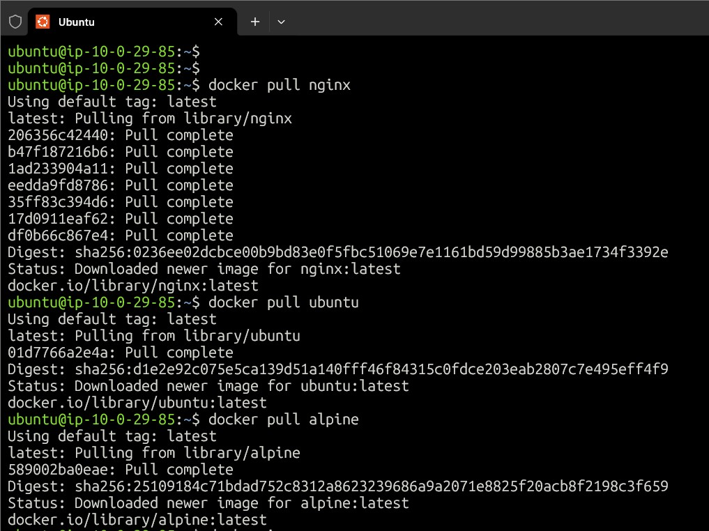
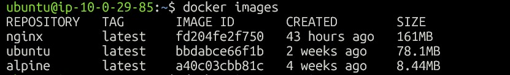
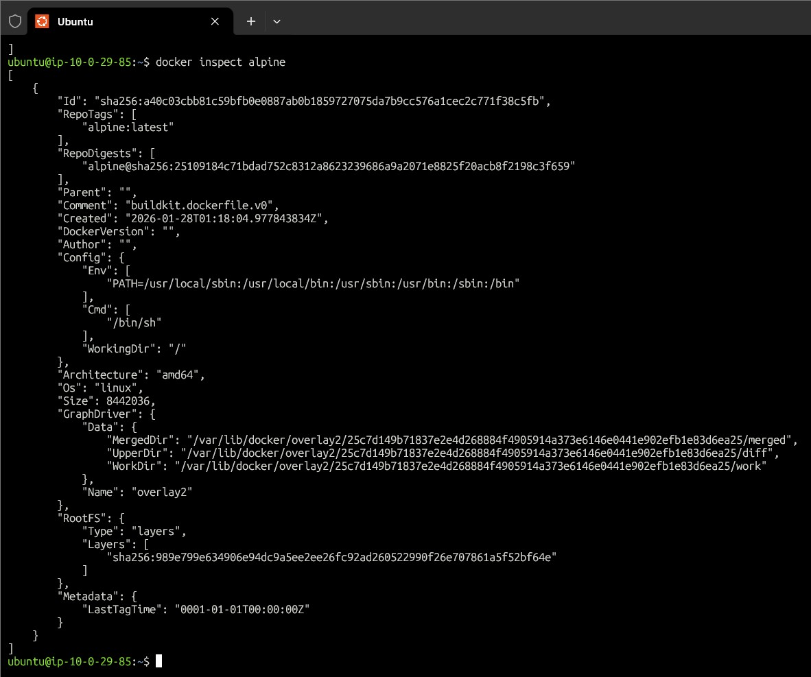
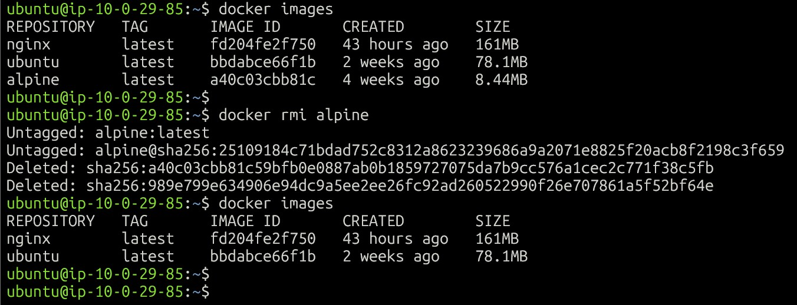
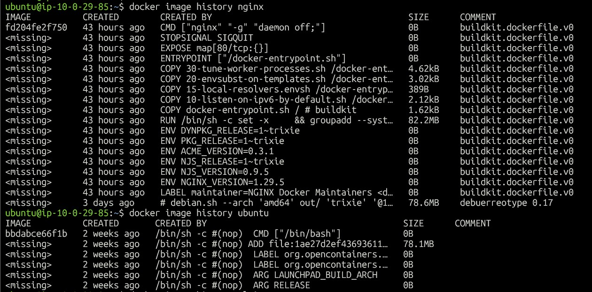
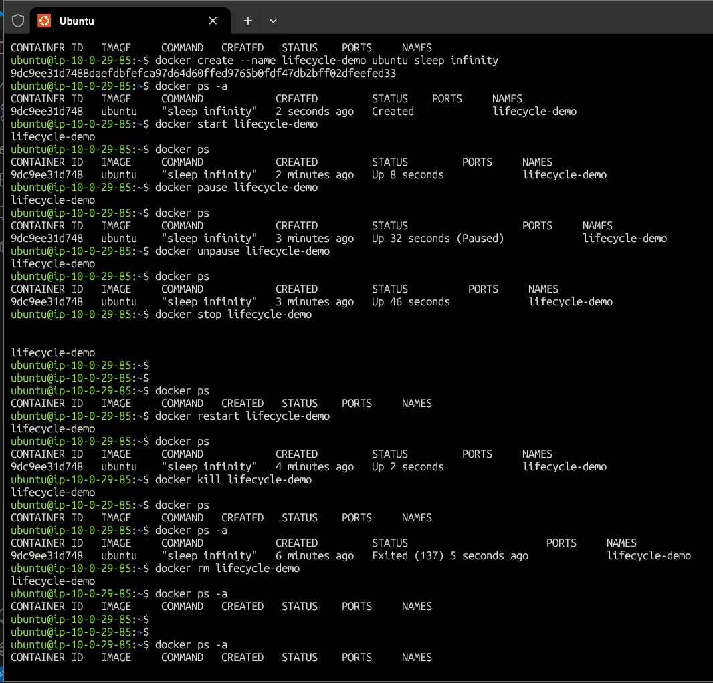
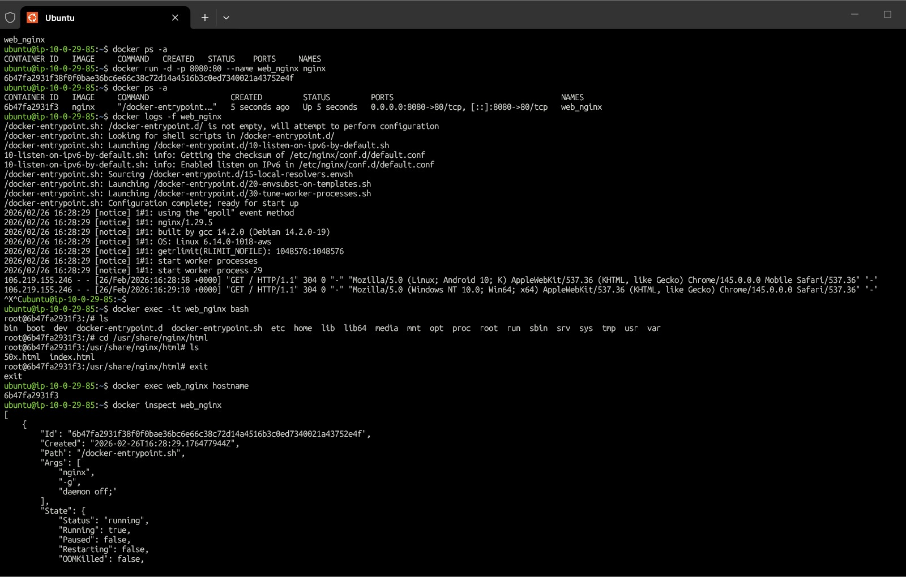
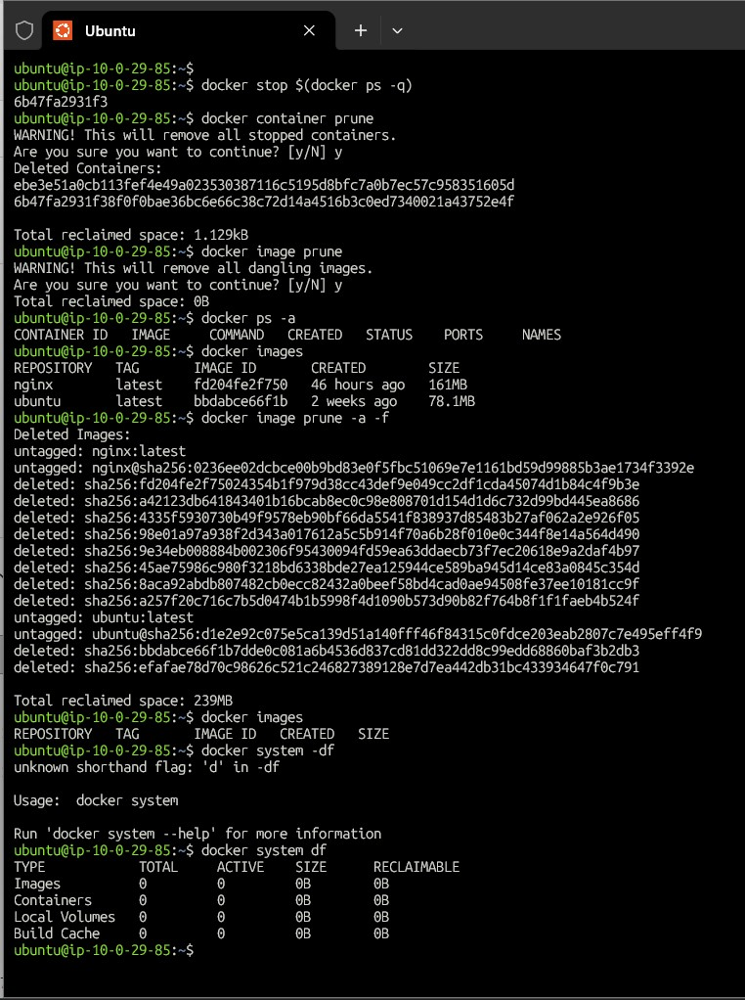

# Day 30 – Docker Images & Container Lifecycle

---

## Task 1 – Docker Images

### Pulled Images

`docker pull nginx`
`docker pull ubuntu`
`docker pull alpine`



---

### List Images

`docker images`

| REPOSITORY | TAG    | IMAGE ID       | CREATED        | SIZE   |
|------------|--------|----------------|----------------|--------|
| nginx      | latest | fd204fe2f750   | 43 hours ago   | 161MB  |
| ubuntu     | latest | bbdabce66f1b   | 2 weeks ago    | 78.1MB |
| alpine     | latest | a40c03cbb81c   | 4 weeks ago    | 8.44MB |



#### Observation:
- alpine is smaller because it is minimal Linux.
- ubuntu contains full OS packages.

alpine ≈ very small (8.44MB)
ubuntu ≈ large (78.1MB)
nginx ≈ very large (161MB)

#### Why alpine smaller?
- Minimal Linux → fewer packages → smaller layers.

---

### Inspect Image

- docker inspect alpine shows internal image configuration and runtime settings in JSON format.

`docker inspect alpine`



---

### Remove Image

- Unused images can be removed using docker rmi to free disk space.
- Docker prevents deletion if containers still depend on the image.

`docker rmi alpine`



---

## Task 2 – Image Layers

`docker image history nginx`

Layers are incremental filesystem changes.
Docker uses layers to optimize storage, enable caching, and make image builds faster and more efficient.
Layers showing 0B represent metadata instructions that do not change the filesystem,
while layers with size contain actual file or package changes.



Each instruction = layer
Docker caches layers → faster builds
0B layers = metadata change

---

## Task 3 – Container Lifecycle

```bash
docker create --name lifecycle-demo ubuntu sleep infinity
docker start lifecycle-demo
docker pause lifecycle-demo
docker unpause lifecycle-demo
docker stop lifecycle-demo
docker restart lifecycle-demo
docker kill lifecycle-demo
docker rm lifecycle-demo
```


#### Observed states:
- Created → Running → Paused → Stopped → Removed

To practice container lifecycle, I created a container using
`docker create ubuntu sleep infinity` so that the container
remains alive during lifecycle operations.
This allowed me to successfully test pause, unpause, stop,
restart, kill, and remove commands while observing state changes
using `docker ps -a` .


---

## Task 4 – Running Containers

#### Run nginx:
`docker run -d -p 8080:80 --name web_nginx nginx`

#### Logs:
`docker logs web_nginx`
`docker logs -f web_nginx`

#### Exec into container:
`docker exec -it web_nginx bash`

#### Run command:
`docker exec web_nginx hostname`

#### Inspect container:
`docker inspect web_nginx`

ran an Nginx container in detached mode and used docker logs and docker logs -f to view startup and real-time logs.
Using docker exec, I accessed the container filesystem and executed single commands without opening a shell.
docker inspect helped me find container details like IP address, port mappings, and mounts.



---

## Task 5 – Cleanup

```bash
docker stop $(docker ps -q)
docker container prune
docker image prune
docker system df
```

---

## What I Learned

- Images are templates and containers are running instances.
- Docker layers improve caching and efficiency.
- Containers have lifecycle states similar to services.

---