# Day 31 – Dockerfile: Build Your Own Images

## Task 1 – First Dockerfile

#### Dockerfile:

1. Create a folder called my-first-image

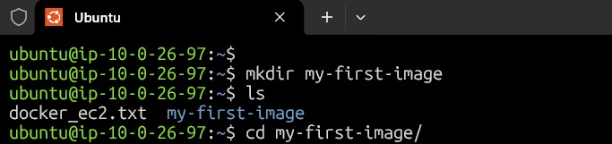

2. Inside it, create a Dockerfile that:
Uses ubuntu as the base image
Installs curl
Sets a default command to print "Hello from my custom image!"

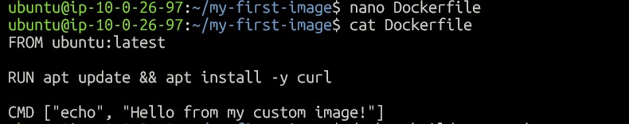

Build the image and tag it my-ubuntu:v1

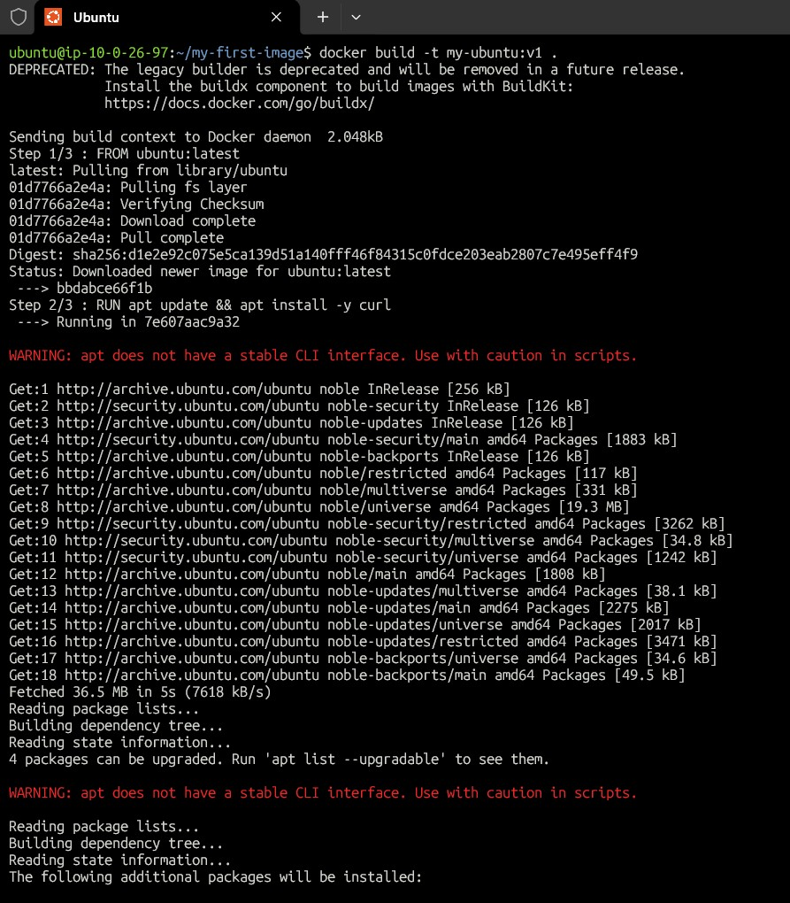

Run a container from your image

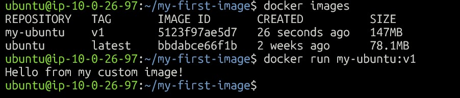

```bash
FROM ubuntu:latest
RUN apt update && apt install -y curl
CMD ["echo", "Hello from my custom image!"]

Build:
docker build -t my-ubuntu:v1 .

Run:
docker run my-ubuntu:v1
```

#### Output:
Hello from my custom image!


---

## Task 2 – Dockerfile Instructions

#### Used:
FROM, RUN, WORKDIR, COPY, EXPOSE, CMD

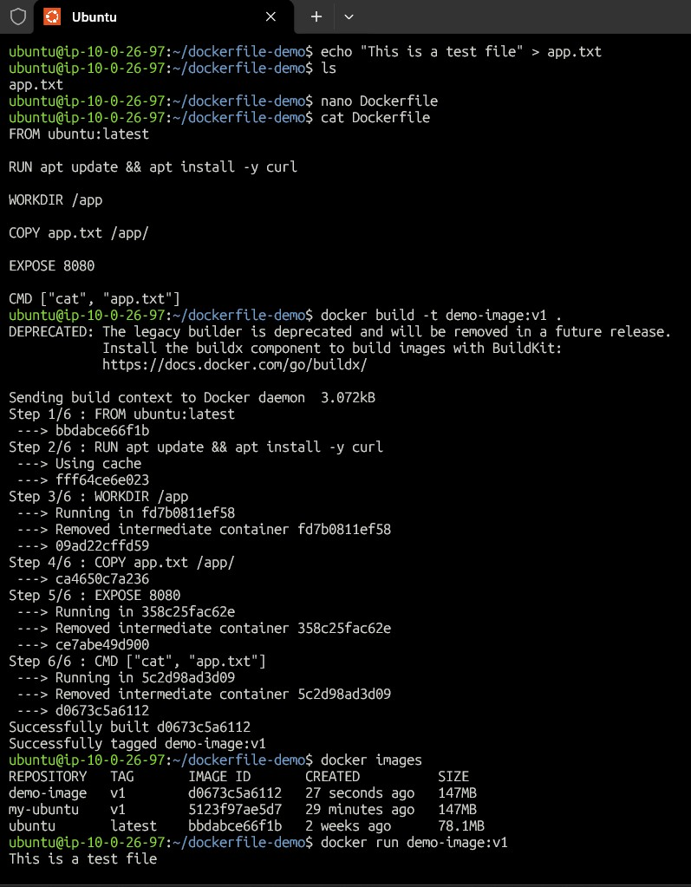

#### Observation:
Each instruction creates a new image layer.
FROM → Base OS
RUN → Executes during build
WORKDIR → Set working directory
COPY → Copy from host
EXPOSE → Documentation only
CMD → Default runtime command

---

## Task 3: CMD vs ENTRYPOINT

### Objective
Understand the difference between `CMD` and `ENTRYPOINT` instructions in a Dockerfile and how they behave when running containers.


### Part 1: Using CMD

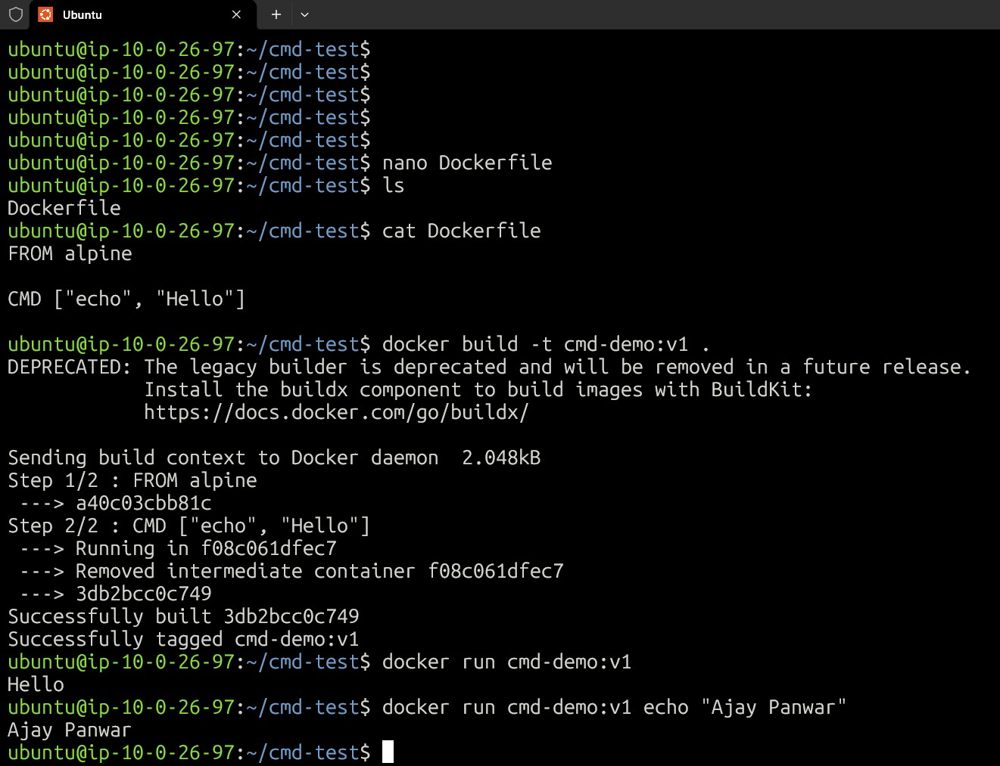

#### Step 1: Create Dockerfile (CMD Example)

```bash
dockerfile
FROM alpine
CMD ["echo", "hello"]
```
#### Step 2: Build Image
`docker build -t cmd-demo .`
#### Step 3: Run Container (Default Command)
`docker run cmd-demo`

#### Output:
`hello`

#### Step 4: Run with Custom Command
`docker run cmd-demo echo "Ajay"`
#### Output:
`Ajay`

#### Observation
The custom command replaces the CMD instruction.

### Part 2: Using ENTRYPOINT

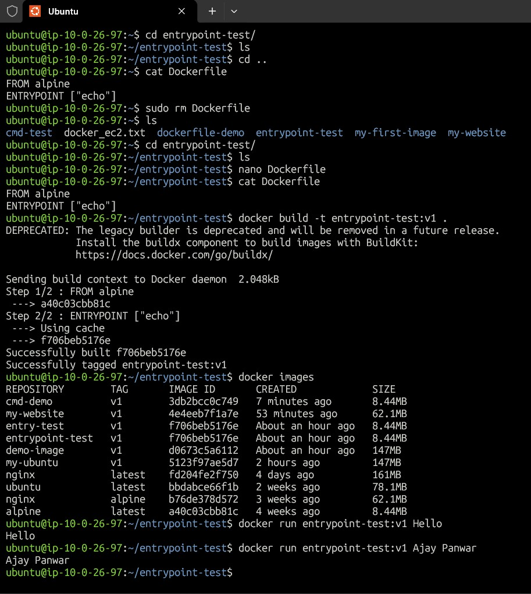

#### Step 1: Create Dockerfile (ENTRYPOINT Example)
```bash
FROM alpine
ENTRYPOINT ["echo"]
```
#### Step 2: Build Image
`docker build -t entrypoint-demo .`
#### Step 3: Run Container
`docker run entrypoint-demo hello`

#### Output:
`hello`

#### Step 4: Run with Additional Arguments
`docker run entrypoint-demo Ajay Panwar`

#### Output:
`Ajay Panwar`

#### Observation
Arguments provided during docker run are appended to the ENTRYPOINT command instead of replacing it.

#### CMD vs ENTRYPOINT — Key Difference

| Feature            | CMD                      | ENTRYPOINT                         |
|--------------------|--------------------------|------------------------------------|
| Purpose            | Default command          | Fixed executable                   |
| Override behavior  | Easily overridden        | Not overridden, arguments appended |
| Flexibility        | High                     | Controlled execution               |
| Best Use           | Default behavior         | Main application container         |

- CMD is used when you want to provide a default command that users can override.
- ENTRYPOINT is used when the container should always run a specific executable and accept arguments.

---

## Task 4 – Build a Simple Web App Image

#### Step 1: Create Static HTML File
I created a simple `index.html` file containing my Dockerized website content.

#### Step 2: Create Dockerfile
I created a Dockerfile using nginx:alpine as the base image and copied the HTML file into the Nginx web directory.
```bash
FROM nginx:alpine
COPY index.html /usr/share/nginx/html/
```
#### Step 3: Build Docker Image
I built the image and tagged it as my-website:v1.

`docker build -t my-website:v1 .`

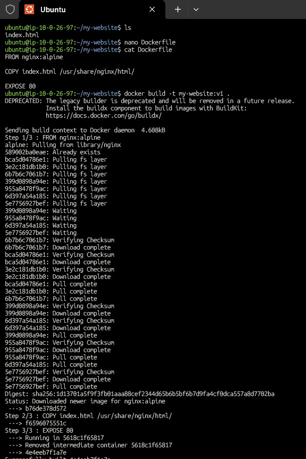


#### Step 4: Run the Container
I ran the container with port mapping to access the website from the browser.
`docker run -d -p 8081:80 --name mysite my-website:v1`

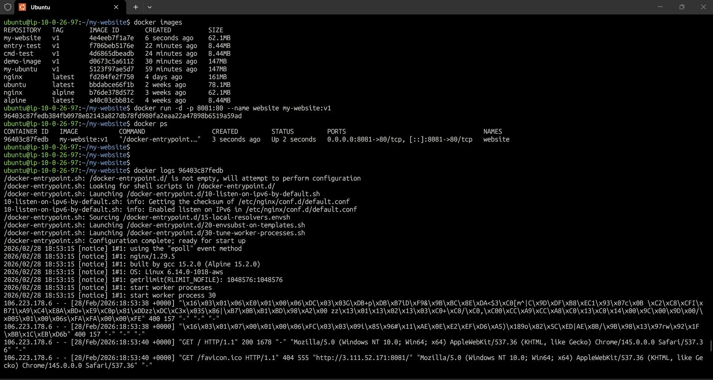


#### Step 5: Access the Website
- The website was successfully accessed using:
👉 http://3.111.52.171/:8081

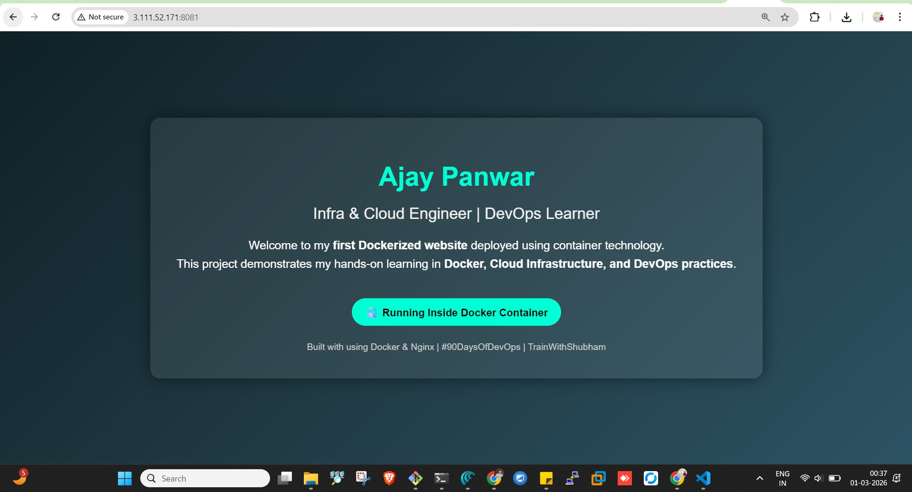

---

## Task 5: .dockerignore

### Objective
Understand how the `.dockerignore` file prevents unnecessary files from being included in a Docker image build context.


#### Step 1: Create `.dockerignore` File

Inside the project folder, I created a file named `.dockerignore`.

`nano .dockerignore`

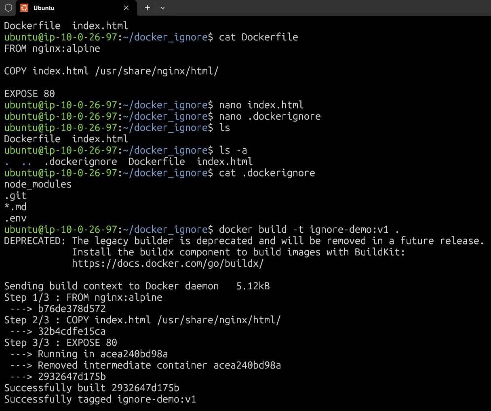

#### Step 2: Add Ignore Rules
I added the following entries:

`node_modules`
`.git`
`*.md`
`.env`

##### Explanation
-  node_modules → prevents large dependency folders from being copied
- .git          → excludes Git repository data
- *.md          → ignores markdown files
- .env          → prevents sensitive environment variables from being added

#### Step 2: Create Static HTML File
I created a simple `index.html` file containing my Dockerized website content.

#### Step 3: Create Dockerfile
I created a Dockerfile using nginx:alpine as the base image and copied the HTML file into the Nginx web directory.
```bash
FROM nginx:alpine
COPY index.html /usr/share/nginx/html/
```

#### Step 4: Build the Docker Image
`docker build -t ignore-demo:v1 .`

- During the build process, Docker used .dockerignore to exclude specified files from the build context.


#### Step 5: Verify Ignored Files
I verified that ignored files were not copied into the image by running:

`docker run -d -p 8081:80 --name docker-ignore ignore-demo:v1`

- Then checking files inside the container:

`ls -la /usr/share/nginx/html`

- The ignored folders and files (node_modules, .git, .md, .env) were not present inside the container.

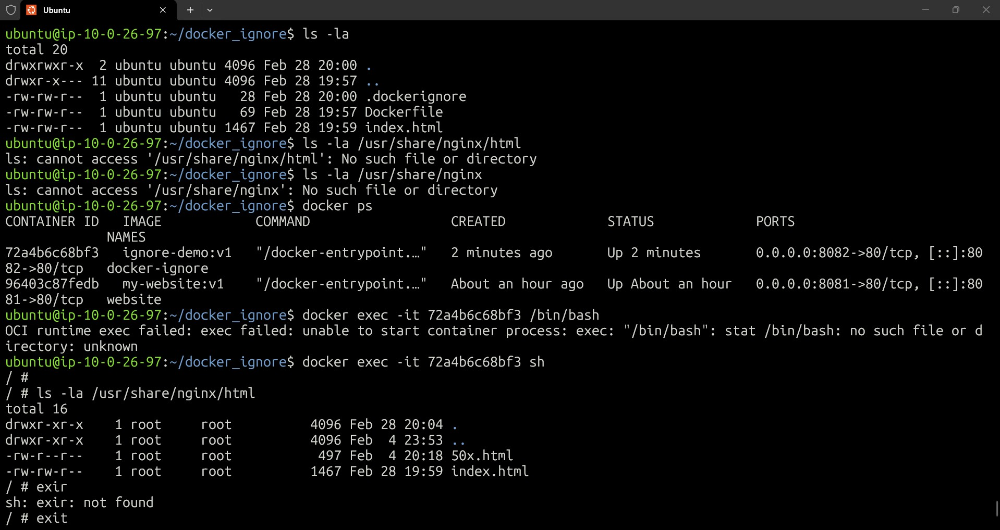

#### Learning Outcome

- The .dockerignore file helps reduce image size, improves build speed, and prevents sensitive or unnecessary files from being included in Docker images.

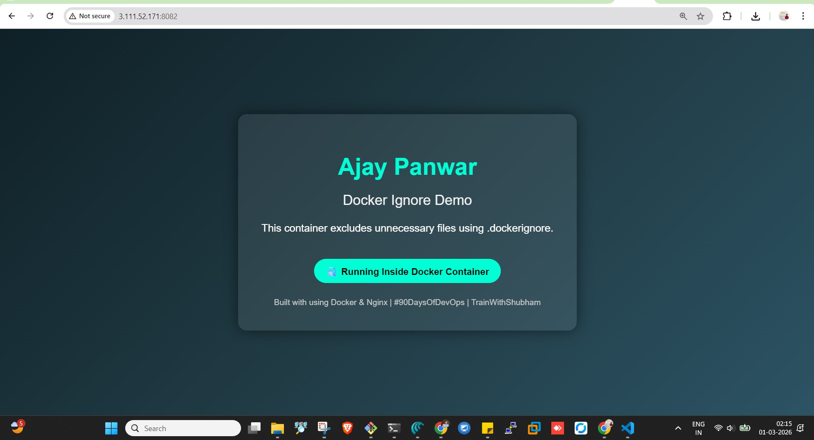


---

## Task 6: Build Optimization

### Objective
Understand how Docker layer caching works and how Dockerfile order affects build speed.

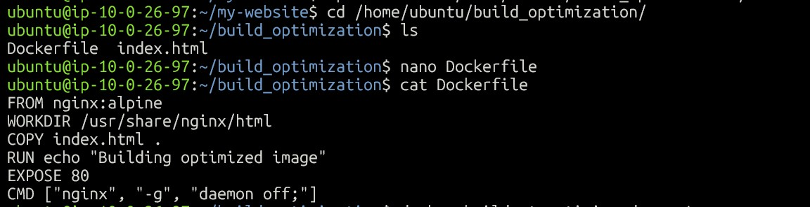

#### Step 1: Create Initial Dockerfile
I created a Dockerfile with the following content:

- dockerfile
```bash
FROM nginx:alpine
WORKDIR /usr/share/nginx/html
COPY index.html .
RUN echo "Building optimized image"
EXPOSE 80
CMD ["nginx", "-g", "daemon off;"]
```

#### Step 2: Build the Image (First Build)
`docker build -t optimize-demo:v1 .`

During the first build, Docker executed all steps because no cache existed.

#### Step 3: Modify One Line
I updated the index.html file by changing some text content.

##### Example change:

- Updated Docker Optimization Demo under header in index.html

#### Step 4: Rebuild the Image
docker build -t optimize-demo:v2 .

##### Observation
Docker reused cached layers for unchanged instructions and rebuilt only the layers after the modified step.

##### Build output showed:
`Using cache`
for earlier steps.

#### Step 5: Optimize Dockerfile Order
I reordered the Dockerfile so frequently changing files are copied last.

##### Optimized Dockerfile
```bash
FROM nginx:alpine
RUN echo "Base setup complete"
WORKDIR /usr/share/nginx/html
EXPOSE 80
COPY index.html .
CMD ["nginx", "-g", "daemon off;"]
```

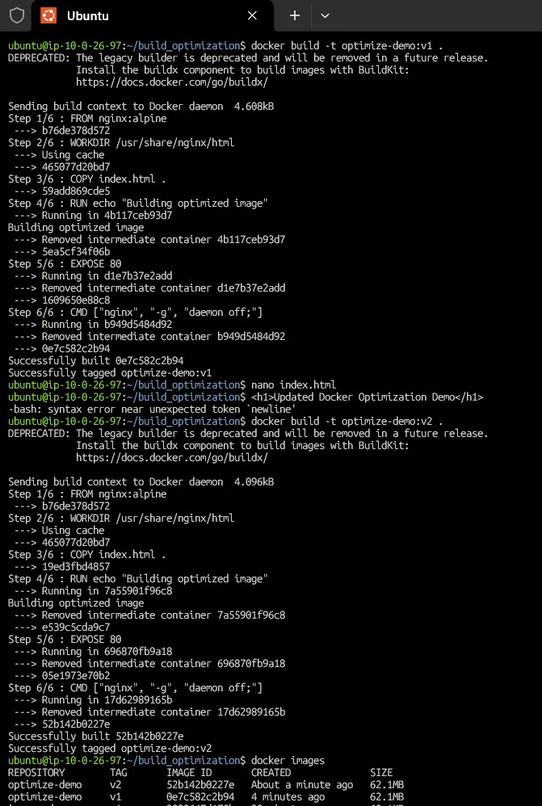


#### Step 6: Why Layer Order Matters

Docker builds images in layers, and each instruction creates a cached layer.
If an earlier layer changes:
All subsequent layers must rebuild.
If frequently changing files are placed near the end:
Earlier layers remain cached.
Build time becomes much faster.

#### Learning Outcome
Docker layer caching improves build performance by reusing unchanged layers.
Placing stable instructions first and frequently changing files last helps optimize build speed and reduces rebuild time.

---

## What I Learned

- Learned how to create custom Docker images using Dockerfiles and understand image layering.
- Understood the purpose of Dockerfile instructions like FROM, RUN, COPY, WORKDIR, EXPOSE, and CMD.
- Learned the difference between CMD and ENTRYPOINT and how container commands behave at runtime.
- Built and deployed a Dockerized static website using an Nginx container with port mapping.
- Understood how `.dockerignore` reduces build context size and protects sensitive files.
- Learned how Docker layer caching works and how rebuilds reuse unchanged layers.
- Discovered that Dockerfile instruction order directly affects build speed and efficiency.
- Gained practical experience in building, running, and optimizing container images.
