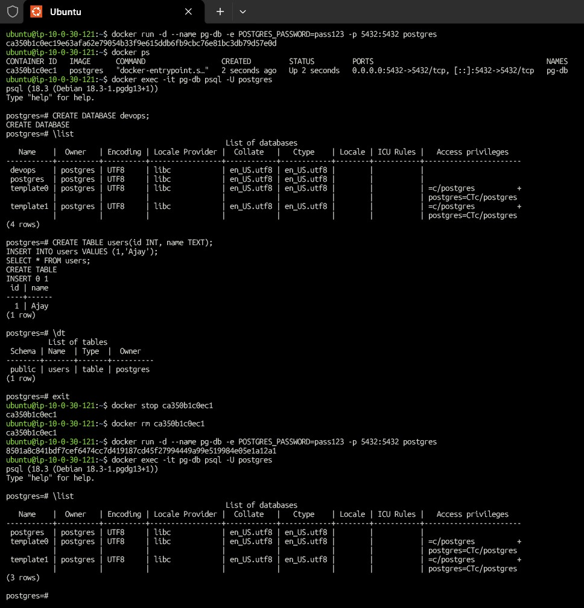
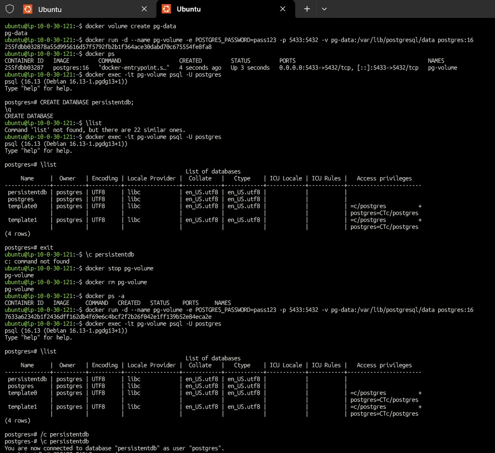
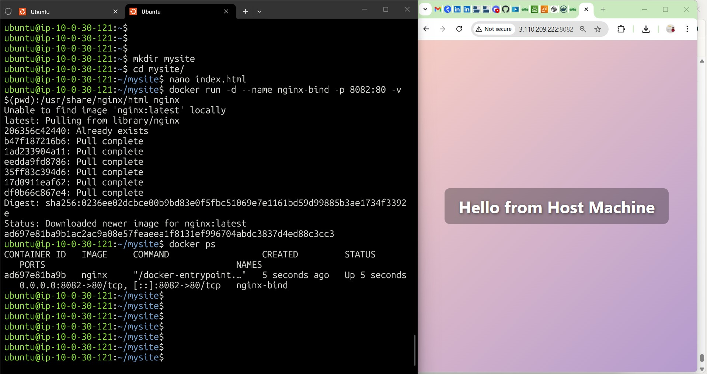
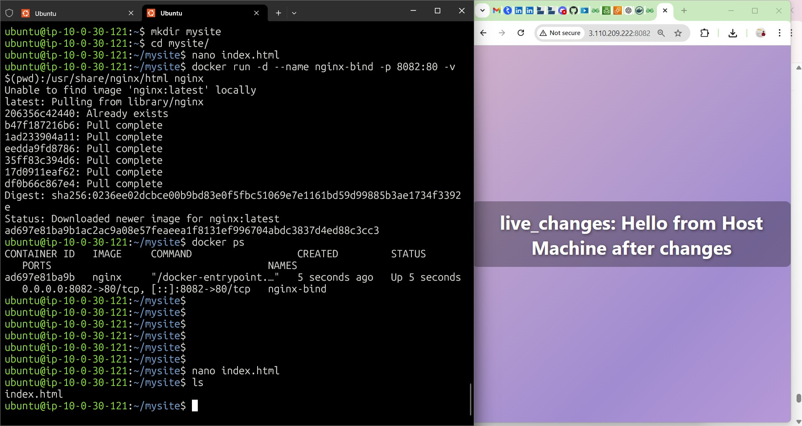
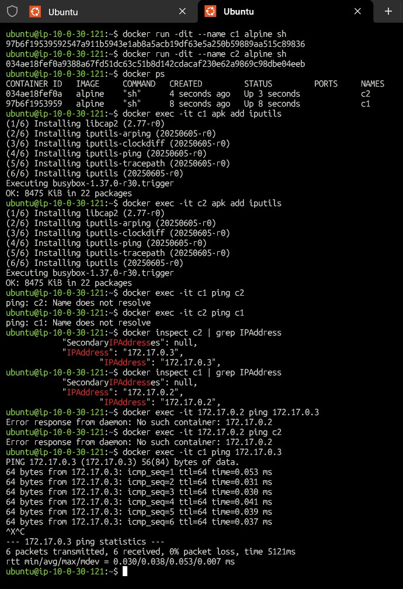
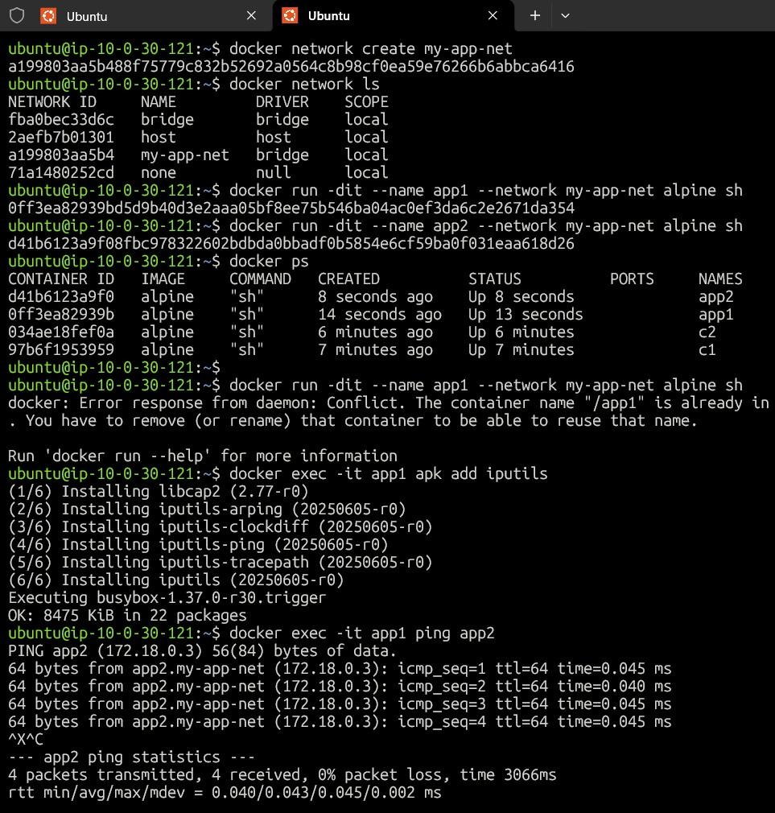
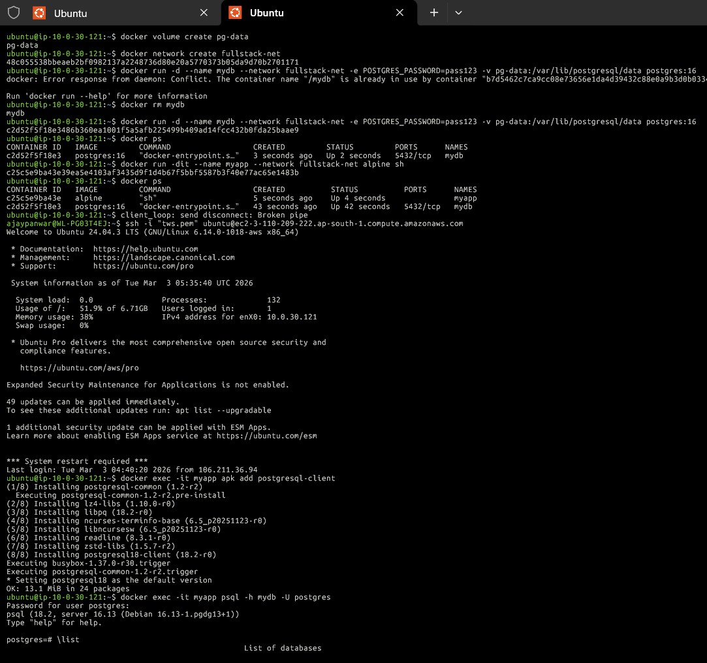

# Day 32 – Docker Volumes & Networking

## Task 1 – Container Data Loss
- Created Postgres container and inserted data.
- After removing container, data was lost.

#### Reason:
- Containers are ephemeral and store data inside writable layer.

---

## Task 2 – Named Volumes
- Created volume:
`docker volume create pg-data`

- Attached volume to Postgres container.
`docker run -d --name pg-volume -e POSTGRES_PASSWORD=pass123 -p 5433:5432 -v pg-data:/var/lib/postgresql/data postgres:16`

#### Result:
- Data persisted even after container removal.

---

## Task 3 – Bind Mounts
- Mounted host directory into Nginx container.

-v $(pwd):/usr/share/nginx/html

- Changes on host reflected instantly in browser.

#### Difference:
- Volumes → production storage
- Bind mounts → development usage.

---

## Task 4 – Default Bridge Network
- Containers could communicate via IP but not name.

---

## Task 5 – Custom Network
- Created network:

`docker network create my-app-net`

- Containers communicated via container names due to Docker DNS.

---

## Task 6 – Full Setup
- Database + App containers connected using custom network and volume.

- App connected using:
`psql -h mydb -U postgres`

---

## What I Learned
- Containers are ephemeral — data stored inside containers is lost when they are removed.
- Docker volumes provide persistent storage and are essential for databases in production.
- Bind mounts allow real-time file changes from host to container, useful for development.
- Default bridge networks allow communication via IP but not container names.
- Custom Docker networks enable automatic DNS-based communication between containers.
- Containers on the same network can communicate using service names like real microservices.
- Combining volumes and networking helps build real-world app + database architectures.
