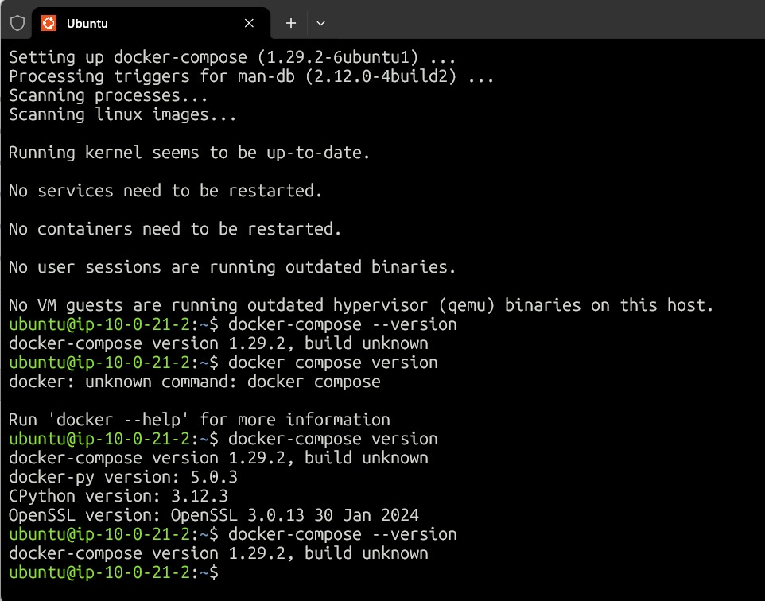
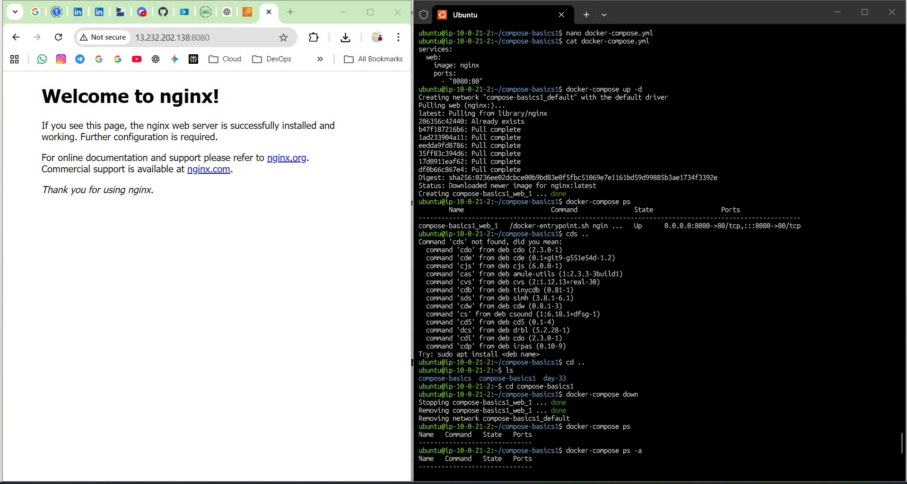
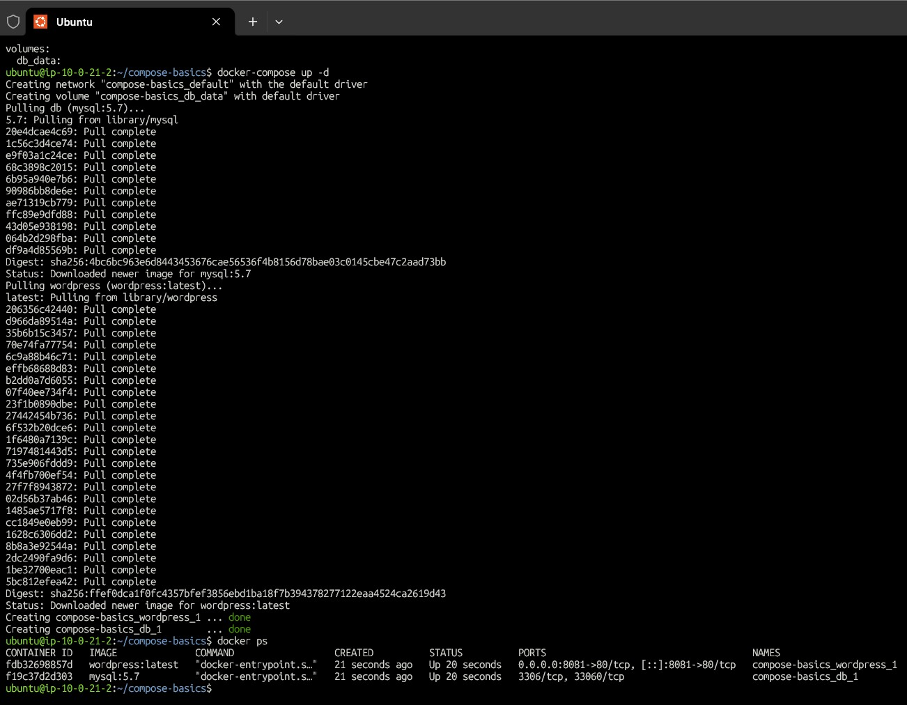
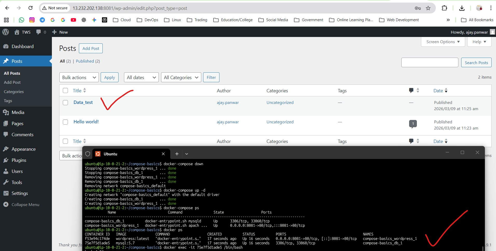
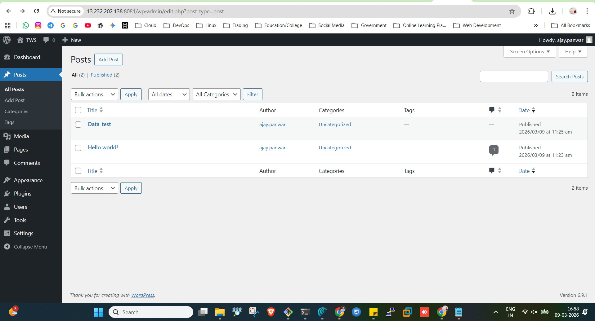
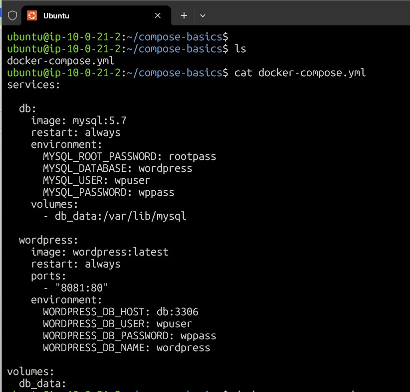
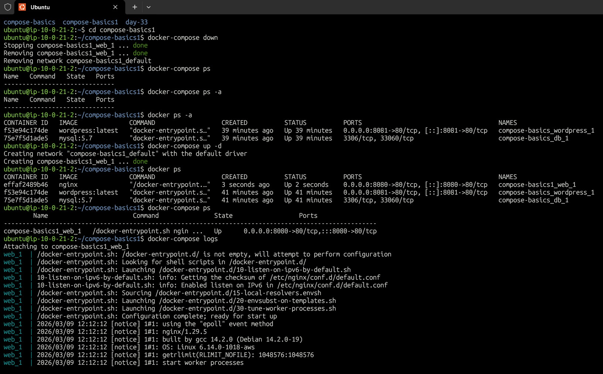
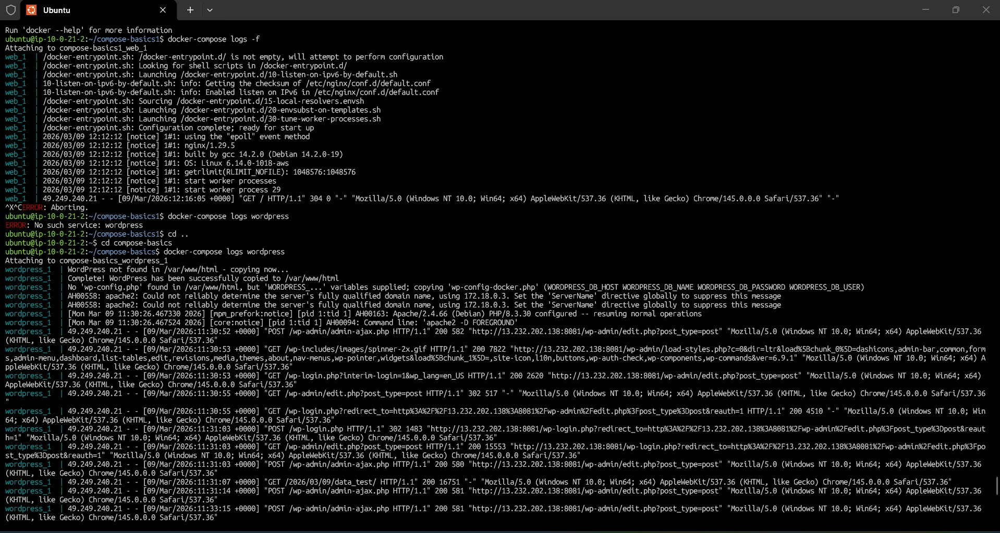
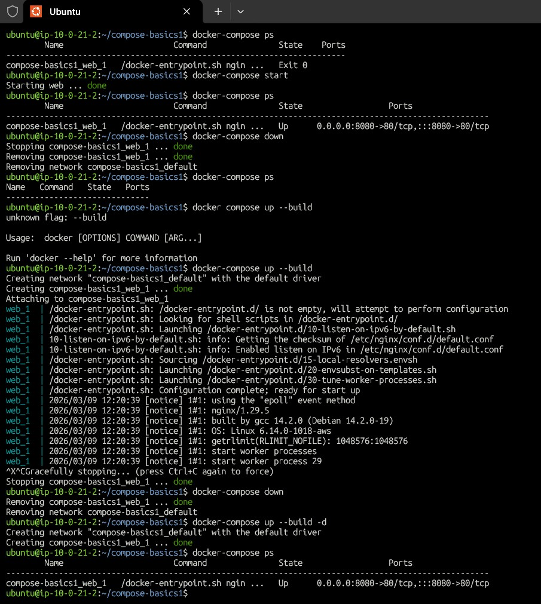
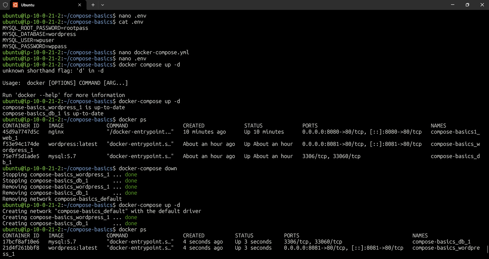

# Day 33 – Docker Compose

## Task 1 – Install & Verify

Verified Docker Compose installation.

- Command:
`docker-compose --version`

---

## Task 2 – First Compose File

Created compose file running Nginx container.

`docker-compose.yml`

services:
  web:
    image: nginx
    ports:
      - "8080:80"

- Started with:
`docker-compose up`

Stopped with:
`docker-compose down`

---

## Task 3 – WordPress + MySQL

Used multi-container setup.

Services:
- MySQL database
- WordPress application

Volume used:
`db_data:/var/lib/mysql`

WordPress connected to database using service name "db".

---

## Task 4 – Compose Commands

`docker compose up -d`
`docker compose ps`
`docker compose logs`
`docker compose logs wordpress`
`docker compose stop`
`docker compose down`
`docker compose up --build`

---

## Task 5 – Environment Variables

Used .env file for database credentials.

Docker Compose automatically loads variables from .env.

---

## What I Learned

- Docker Compose simplifies running multi-container applications.
- Services automatically communicate using service names.
- Volumes provide persistent storage for databases.
- Compose automatically creates networks for containers.
- Environment variables improve configuration management.
- One YAML file can define the entire application stack.